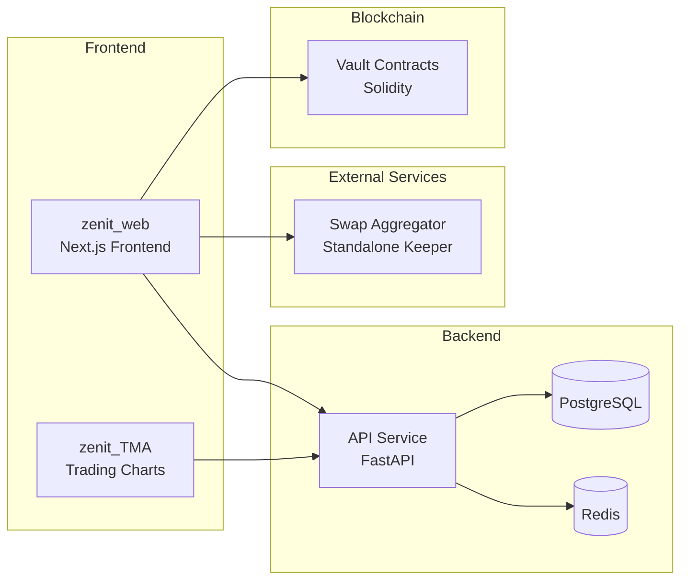

# Zenit

> A comprehensive crypto trading intelligence platform powered by Hedera.

Zenit is a full-stack trading platform providing real-time market signals, vault-based yield strategies, AI-powered analytics, and cross-DEX liquidity aggregation — all built on Hedera and other major blockchain networks.

---

## What Zenit Provides

| Component | Description |
|-----------|-------------|
| **API Service** | Backend delivering signals, vault data, AI assistant, and real-time WebSocket streaming |
| **Web Frontend** | Next.js app for browsing vaults, portfolio management, and AI chat |
| **TMA Platform** | Trading & Market Analytics with advanced charts and trend analysis |
| **Swap Aggregator** | Perpetual DEX + liquidity router across Hedera DEXs |
| **Vault Contracts** | Smart contracts for on-chain vault strategies |

---

## Quick Links

| Service | README | Tech |
|---------|--------|------|
| API Service | [api_service/README.md](./api_service/README.md) | FastAPI, PostgreSQL, Redis |
| Web Frontend | [zenit_web/README.md](./zenit_web/README.md) | Next.js 16, Tailwind, Zustand |
| TMA Platform | [zenit_TMA/README.md](./zenit_TMA/README.md) | Next.js 16, TradingView |
| Swap Aggregator | [swap_aggregator/README.md](./swap_aggregator/README.md) | Node.js, Hardhat, React |
| Vault Contracts | [vault_contract/README.md](./vault_contract/README.md) | Solidity, Hardhat |

---

## Supported Blockchains

- **Hedera** (primary) — EVM-compatible, HTS tokens
- **Ethereum** / EVM chains
- **Solana**
- **Polkadot**
- **Aptos**
- **Cardano**
- **BNB Chain**

---

## Key Features

- **Real-Time Signals** — RSI, ADX, PSAR indicators with push notifications
- **Trading Vaults** — On-chain yield strategies with live performance tracking
- **AI Market Assistant** — GPT-4o-mini powered chat with technical analysis
- **Liquidity Aggregation** — Cross-DEX routing for best swap rates
- **Perpetual Trading** — Long/short positions with leverage up to 10x
- **Portfolio Dashboard** — Unified view of balances and vault earnings

---

## Architecture Overview

---

## Getting Started

Each subproject has its own setup instructions. Generally:

1. **API Service**: `cd api_service && pip install -r requirements-core.txt`
2. **Web Frontend**: `cd zenit_web && yarn install && yarn dev`
3. **TMA Platform**: `cd zenit_TMA && yarn install && yarn dev`
4. **Swap Aggregator**: See `swap_aggregator/README.md`

---

## License

MIT